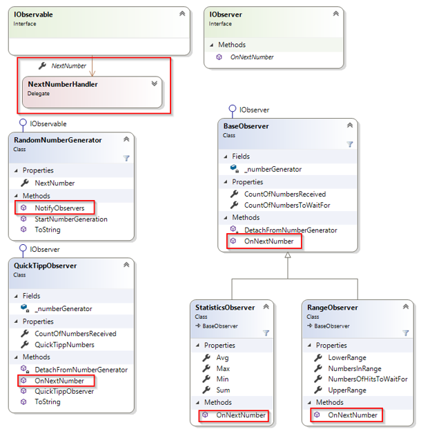

# NumberGenerator mit Delegate

## Lehrziele

* `Delegates` zur Implementierung des Observerpatterns

## Aufgabenstellung

Überarbeiten Sie die Lösung mit der Vorwoche (Observers und Observable), indem Sie im Interface `IObservable` ein Delegate `public delegate void NextNumberHandler(int number)` definieren und im Interface festlegen, dass jedes Observable ein Property anbieten muss, dass den Observern den Zugriff auf dieses Delegate ermöglicht.

Der `RandomNumberGenerator` implementiert das Interface `IObservable` und bietet den Observern daher die Möglichkeit auf dem Property `NextNumber` eine Callbackmethode zu registrieren, die im Falle einer neuen Zufallszahl aufgerufen wird. `Attach` wird von Delegates über den Operator `+=`, `Detach` über `-=` angeboten.

Das Hauptprogramm ist derart abzuändern, dass die Funktionalitäten der Observer/Observable-Implementierung erhalten bleiben.

Passen Sie die Unittests derart an, dass wieder alle Testfälle Sinn ergeben und von Ihrer Lösung bestanden werden.

## Klassendiagramm

Ist das Interface `IObserver` noch notwendig?

Gäbe es Implementierungsalternativen und welche Vor- und Nachteile hätten diese?

